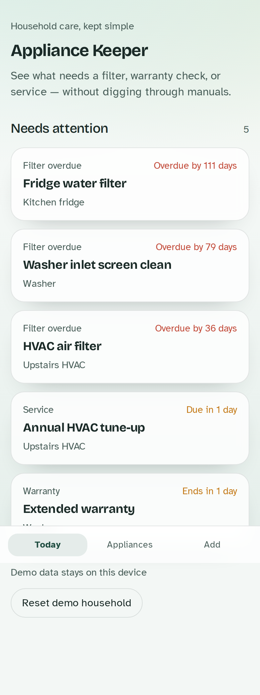
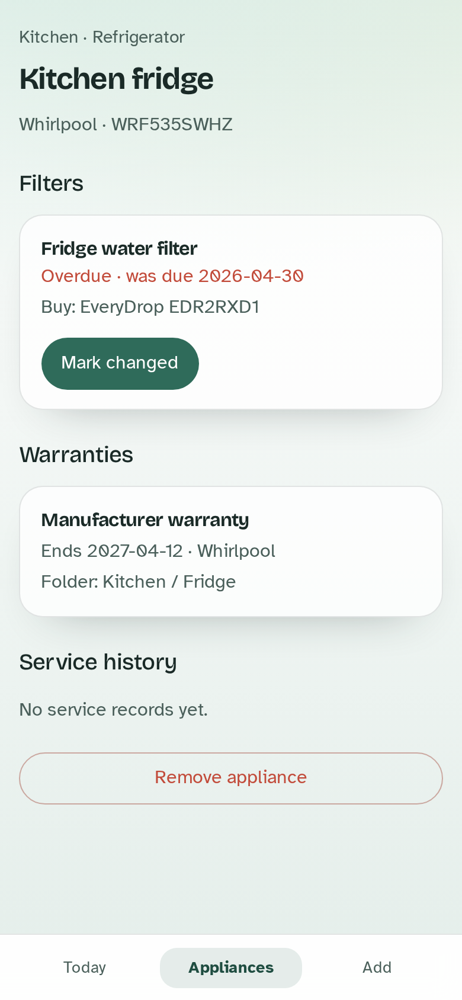
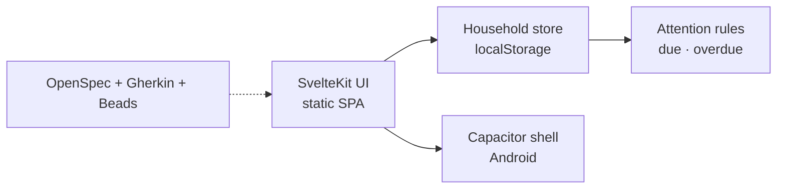
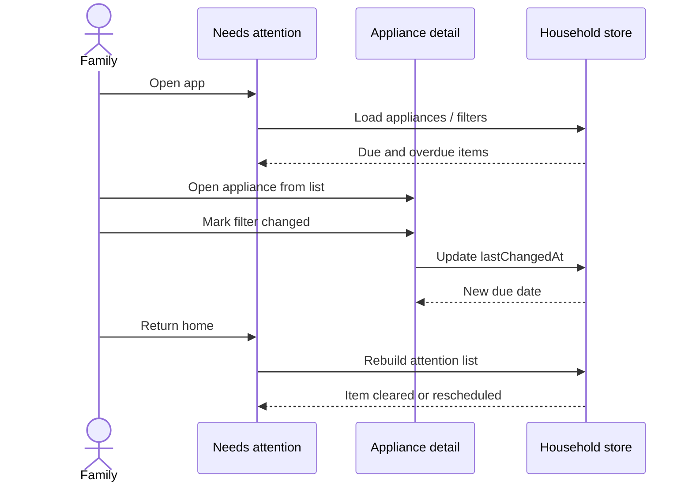

# Appliance Keeper

Local-first household tracker for appliances, filter changes, warranties, and service history. Built for non-technical family members: plain language, a calm **Needs attention** home screen, and data that stays on the device.

Today you can browse a demo household, see due and overdue filters/warranties/service, and mark a filter as changed. Nothing leaves the device.

## Screenshots

| Needs attention | Appliance detail |
|-----------------|------------------|
|  |  |

## Architecture



- **Web:** SvelteKit + adapter-static (SPA fallback)
- **Native:** Capacitor wraps `build/` (`com.mowgli42.appliancekeeper`)
- **Persistence:** on-device only (`localStorage`)
- **Specs:** living OpenSpec under `openspec/specs/`, verified by `features/*.feature`

## Sequence: filter care



## Remaining / planned

- Warranty / service add forms (Beads)
- Native Capacitor Filesystem storage for large media (Beads)
- Optional on-device OCR for nameplates (future)
- Cloud sync, recall APIs — explicitly out of scope for now

See `openspec/project.md` for living specs, including archived Centriq-style media / useful-life / dossier work that is specified but not all shipped in the Phase 1 UI.

## Run locally

```bash
npm install
npm run dev
```

Open [http://localhost:5173](http://localhost:5173).

## Build & Capacitor

```bash
npm run build
npm run preview
npm run cap:sync
npx cap open android
```

Static output is in `build/` (SPA fallback `index.html` for client-added appliances). App id: `com.mowgli42.appliancekeeper`.

## Spec-driven development

See **`openspec/WORKFLOW.md`**.

| Piece | Location |
|-------|----------|
| Living specs | `openspec/specs/` |
| Gherkin | `features/*.feature` |
| Unit tests | `src/lib/**/*.test.ts` |
| Tasks | `bd ready` |

```bash
npm test
npm run test:gherkin
```
