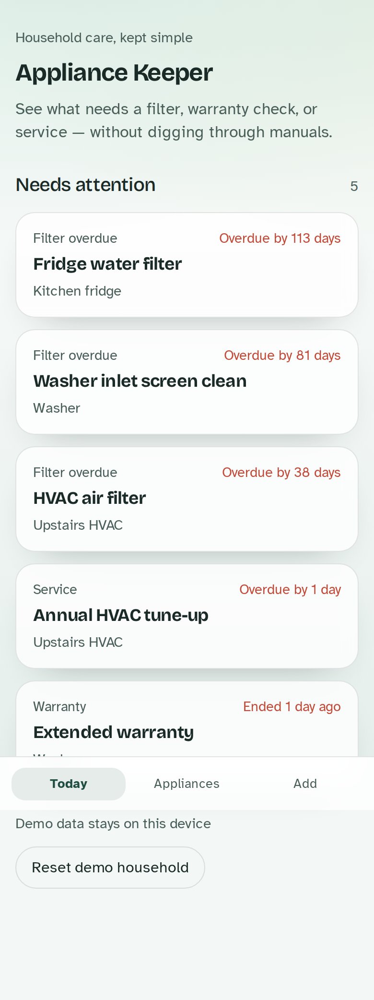
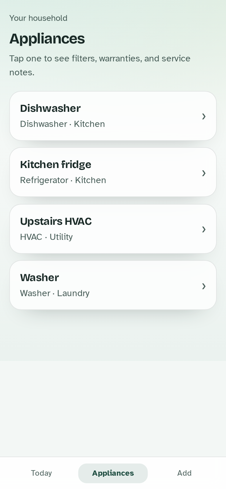
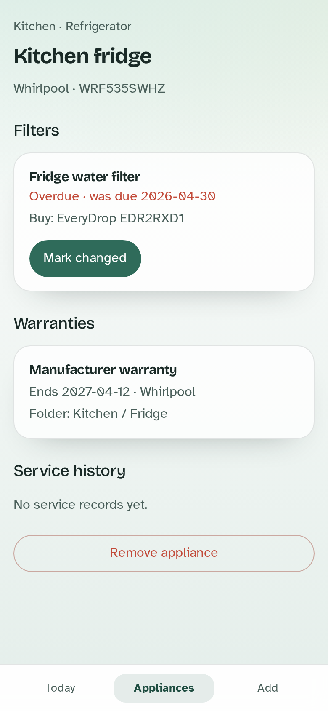
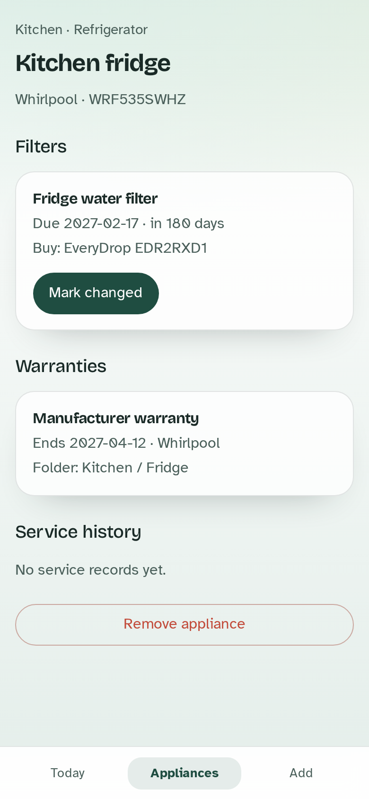
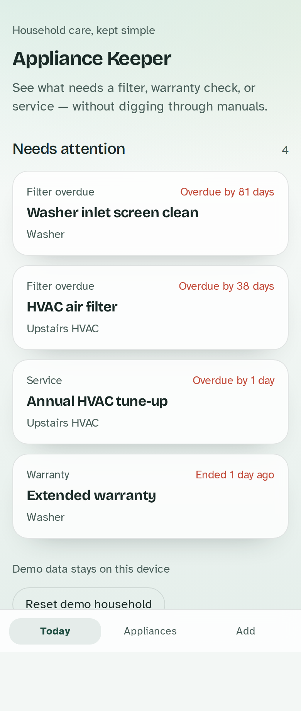
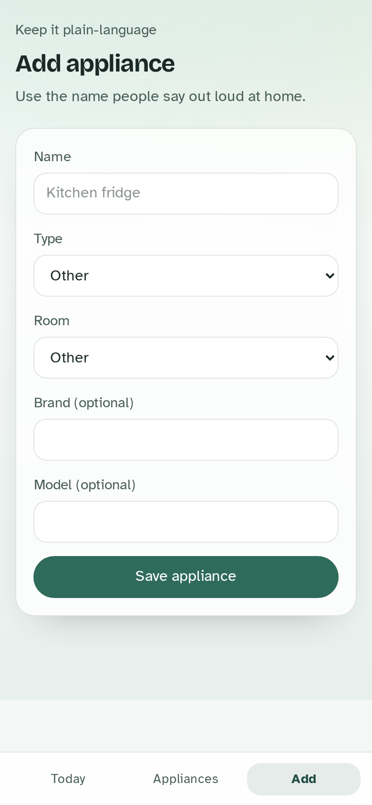
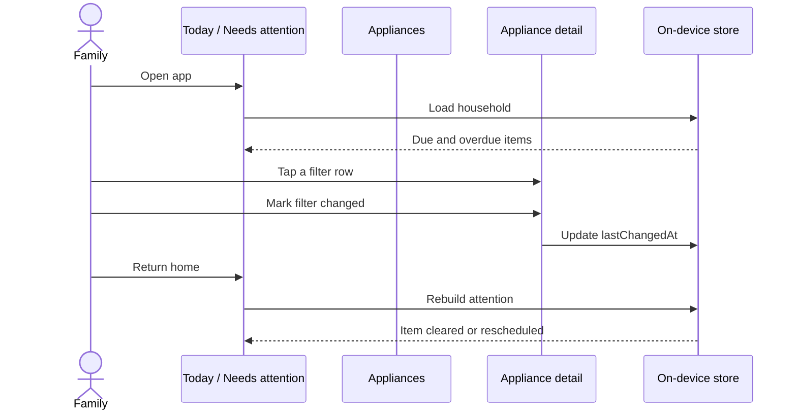
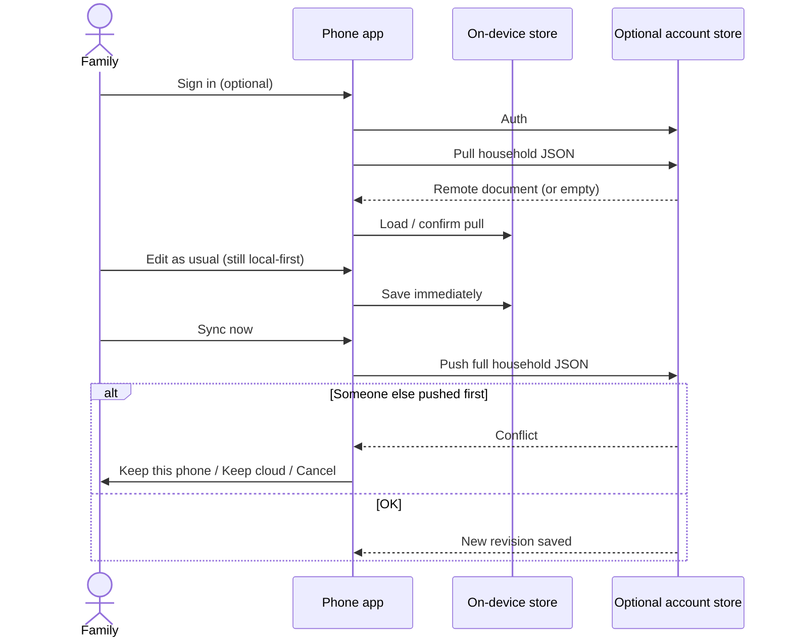

# Appliance Keeper — workflow walkthrough

Plain-language tour of what works **today** on the device, plus the **planned** sign-in sync flow for iPhone + Android.

Data stays on the phone unless you later opt into account sync.

---

## 1. Open the app — Needs attention

The home screen (**Today**) answers one question: *what should someone in the house do soon?*



You see overdue filters, upcoming service, and warranties that end soon. Tap a row to open that appliance.

Nothing due? You’ll get an all-clear and a link to browse appliances.

---

## 2. Browse the household

**Appliances** lists every machine by the name people actually say (“Kitchen fridge”, “Upstairs HVAC”).



Tap one for filters, warranties, and service history.

---

## 3. Appliance detail

Identity (room, type, brand/model) sits at the top. Below that: filters with due dates, warranties, and past service.



---

## 4. Mark a filter changed

When you replace a filter, tap **Mark changed**. The app records today as the last-changed date and recalculates the next due date from the interval (for example every 180 days).



---

## 5. Home updates automatically

Back on **Today**, that filter drops off (or moves later) because attention is rebuilt from the same on-device data.



---

## 6. Add an appliance

**Add** uses everyday language — name, type, room, optional brand/model. Save opens the new appliance’s detail page.



---

## End-to-end (today)



**Also useful**

- **Reset demo household** — restores the sample data on this device only.
- Demo data never leaves the device in Phase 1.

---

## Planned later: sign in → pull/push JSON

Not built yet. Design lives in [`openspec/changes/add-optional-account-json-sync/`](../openspec/changes/add-optional-account-json-sync/proposal.md).

Goal: same household on iPhone and Android without turning the app into a complex realtime editor.



**Still true after sync ships**

- Signed out = today’s behavior (local only).
- Edits never wait on the network.
- Whole-document pull/push — not field-by-field CRDT merge.

---

## Regenerating screenshots

```bash
npm run build
npm run preview -- --host 127.0.0.1 --port 4173
# other terminal:
node scripts/screenshots.mjs
```

Images land in `docs/images/` (`01`–`06`).
