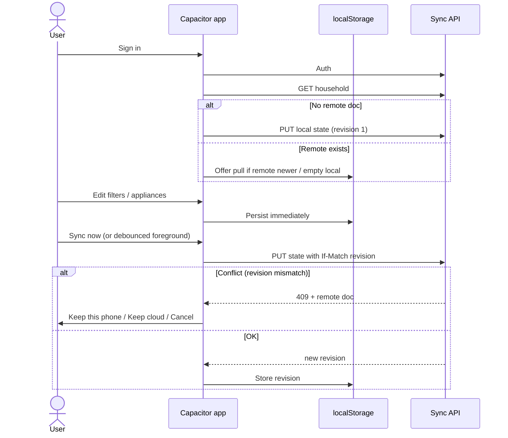

# Design — optional account JSON sync

## Principle

**Local-first with optional cloud copy.** The phone remains the working copy. The server stores one versioned household document per signed-in household. Sync is explicit and boring.

## Data shape

Reuse the existing `HouseholdState` (appliances, filters, warranties, services, media metadata). Wrap it for the wire:

```ts
type HouseholdRemoteDocument = {
  schemaVersion: number;       // e.g. 2 for appliance-keeper:v2
  updatedAt: string;           // ISO timestamp from the device that last pushed
  revision: number;            // monotonic per household; server increments on accept
  state: HouseholdState;       // same JSON the app already persists
};
```

v1 may omit large `dataUrl` media blobs (or cap size) so pushes stay small; photos can remain device-local until a media-blob follow-up.

## Auth

| Backend | Why |
|---------|-----|
| **Supabase** | Fastest hosted path: auth + row-level security + JSON/JSONB column |
| **PocketBase** | One binary on a VPS; “our own data” with minimal ops |

UI: Sign in / Sign out on a Settings screen. No account required to use the app.

## Sync algorithm (simple)



### Rules

1. **Local writes never block on network.** Edits always hit `localStorage` first.
2. **Push sends the whole `HouseholdState`**, not a patch stream (acceptable for household-scale JSON).
3. **Conflicts** use last-revision wins with an explicit picker — not silent merge.
4. **Pull** replaces local state only after user confirmation if local `updatedAt` is newer than remote.
5. **Secrets** stay in env / Capacitor config; never commit service keys.

## API sketch (logical)

- `GET /household` → `{ revision, updatedAt, state }` or 404
- `PUT /household` with `If-Match: <revision>` body `{ updatedAt, state }` → `{ revision }`
- Auth: bearer session from Supabase/PocketBase

Row-level security: each row owned by `auth.uid()` (or PocketBase user id). One household per user in v1 (family can share one login; multi-member invites are a later change).

## Capacitor notes

- Same web sync code path for browser preview, Android, and iOS.
- Use the OS secure storage for session tokens if the auth SDK supports it; otherwise the SDK’s default session persistence.
- Background sync is optional; “Sync now” + sync-on-resume is enough for v1.

## Privacy

- Sync is **opt-in**. Signed-out = no network household calls.
- No analytics/telemetry required for sync.
- Export / dossier remains available offline so families can leave without lock-in.

## Implementation order (when we build it)

1. Settings: sign-in UI + session restore  
2. Remote document GET/PUT against chosen backend  
3. Sync now + conflict picker  
4. OpenSpec living spec `account-sync` + Gherkin  
5. Optional: media blob upload follow-up  

## Non-goals reminder

This is not fleet-tracker-style offline event sourcing. Whole-document pull/push keeps the family app understandable and testable.
